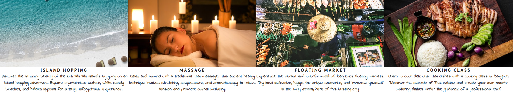

# We Love Thailand

This is a project that showcases the beauty of Thailand. We have compiled a list of some of the most beautiful destinations in Thailand, along with information about each destination, so that you can plan your next trip to this amazing country.

# Getting Started

To view the website, simply click on the following link: [View the live project here](https://rockypraxe.github.io/We-Love-Thailand-project-1/)

# Feautres

-  A list of destinations in Thailand with information and pictures.
-  Responsive design that adjusts to different screen sizes.
-  Navigation bar that makes it easy to navigate to different sections of the website.

- Responsive footer that includes links to social media accounts and copyright information.

# Visitors section

-  The "Visitors" section on the We Love Thailand website provides information and tips for tourists who are planning to visit Thailand, including recommendations why they should visit the country.

# What to do section

-  The "What To Do" section on the We Love Thailand  website provides recommendations for activities and experiences that visitors can enjoy in Thailand, such as trying local food, visiting temples and historical sites, enjoy a massage, relaxing and exploring natural wonders like beaches and waterfalls.

# Footer

-  The footer section includes links to the relevant social media sites. The links will open to a new tab to allow easy navigation for the user.
-  The footer also includes copyright with a link to [RockyPraxe](https://github.com/RockyPraxe) profile on github
-  The footer is valuable to the user as it encourages them to keep connected via social media

# Gallery 

-  The "Gallery" section on the We Love Thailand  website features a collection of high-quality images showcasing the beauty of Thailand. Visitors can browse through the gallery and view pictures of different destinations, attractions, and activities in Thailand to get inspiration for their own travels.

